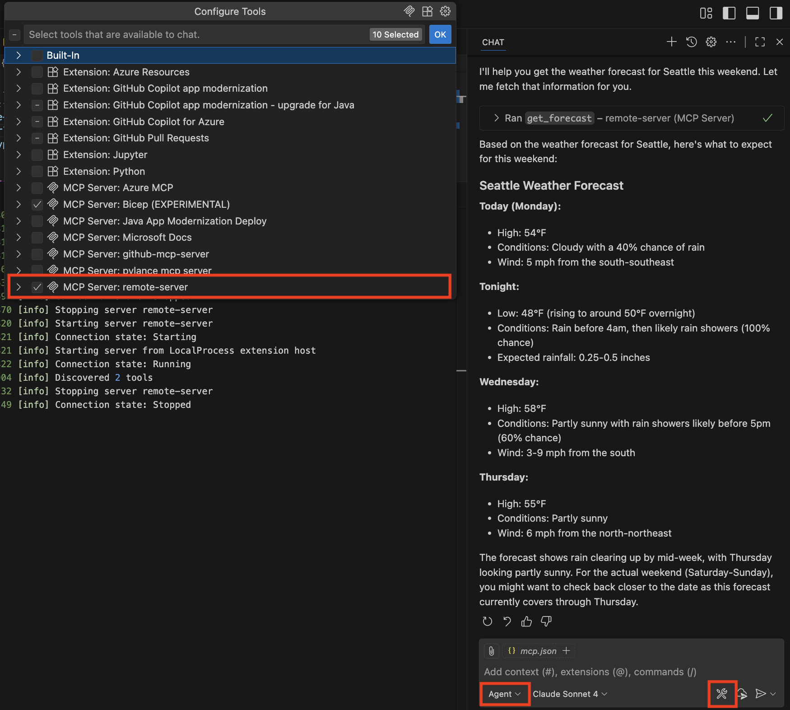

# Host remote MCP servers built with official MCP SDKs on Azure Functions (public preview)

This repo contains instructions and sample for running a Model Context Protocol (MCP) server built with **Java/Quarkus** on Azure Functions. The sample is a simple weather server that you can clone to run locally and deploy to the cloud with the Azure Developer CLI in minutes.

## Running MCP server as custom handler on Azure Functions

[Azure Functions MCP extension](https://techcommunity.microsoft.com/blog/appsonazureblog/build-ai-agent-tools-using-remote-mcp-with-azure-functions/4401059) allows developers to build MCP servers using Functions triggers and bindings, which is essentially Function's event-driven programming framework. These MCP servers can be hosted remotely on the serverless platform just like any Function App.

For those already built servers with [Anthropic's MCP SDKs](https://github.com/modelcontextprotocol/servers?tab=readme-ov-file#model-context-protocol-servers) or prefer building with these SDKs, it's also possible to host the servers on Azure Functions by running them as **custom handlers**. Custom handlers are lightweight web servers that receive events from the Functions host. They allow you to host your MCP servers with **no code changes** and benefit from Azure Function's bursty scale, serverless pricing model, and security features.

This repo focuses on the second scenario:  

<div align="center">
  
</div

## Prerequisites 

* [Java 17](https://www.java.com/en/download/), [Maven 3.8](https://maven.apache.org/install.html) or above
* [Node.js 18](https://nodejs.org/en/download) or above (for E2E test)
* [Azure subscription](https://azure.microsoft.com/free/dotnet/)
* [Azure Developer CLI (azd)](https://learn.microsoft.com/azure/developer/azure-developer-cli/install-azd) v1.17.2 or above
* [Azure Functions Core Tools](https://learn.microsoft.com/azure/azure-functions/functions-run-local?tabs=windows%2Cisolated-process%2Cnode-v4%2Cpython-v2%2Chttp-trigger%2Ccontainer-apps&pivots=programming-language-typescript) v4.5.0 or above
* [Visual Studio Code](https://code.visualstudio.com/)

## Test the server locally

1. Clone the repo and navigate to the `quarkus-mcp-server` directory: 
    ```shell
    git clone https://github.com/Azure-Samples/mcp-sdk-functions-hosting-java.git 
    cd quarkus-mcp-server
    ```
1. Build the server with debug profile: 
    ```shell
    mvn clean package -P debug
    ```
1. Navigate to the `target/azure-functions/quarkus-mcp` directory then start the server:
    ```shell
    cd target/azure-functions/quarkus-mcp 
    func start
    ```
1. Open _.vscode/mcp.json_ and start the server by clicking the _Start_ button above the **local-mcp-server**. Once the server displays the number of tools available, it's ready to be used.
1. Click on the Copilot icon at the top to open chat (`Ctrl+Command+I / Ctrl+Alt+I`), and then change to _Agent_ mode in the question window.
1. Click the tools icon and make sure **local-mcp-server** is checked for Copilot to use in the chat:
    
1. Ask "Return the weather in NYC using #local-mcp-server." Copilot should call one of the weather tools to help answer this question.
1. Stop the server once you're done testing with `Ctrl+C`.


## Deployment 

1. In the `quarkus-mcp-server` directory, build the server for deployment: 
    ```shell
    mvn clean package
    ```
1. Create a new azd project environment. The name of the environment becomes resource group name where Azure resources are deployed to: 
    ```shell
    azd env new <environment-name>
    ```
1. This sample uses Visual Studio Code as the main client. Configure it as an allowed client application:
    ```shell
    azd env set PRE_AUTHORIZED_CLIENT_IDS aebc6443-996d-45c2-90f0-388ff96faa56
    ```
    >[!NOTE]
    >Microsoft employees using a Microsoft tenant must provide a service management reference (your Service Tree ID): `azd env set SERVICE_MANAGEMENT_REFERENCE <ID>`. Without it you won't be able to create the Entra app registration, and provisioning will fail. 

1. Run `azd up` in the **root directory** (where `azure.yaml` is). Pick an Azure subcription to deploy resources to and select from the available regions (e.g. East US). Enable vnet if preferred. 

    When the deployment finishes, your terminal will display output similar to the following:

    ```shell
      (✓) Done: Resource group: rg-resource-group-name (12.061s)
      (✓) Done: App Service plan: plan-random-guid (6.748s)
      (✓) Done: Virtual Network: vnet-random-guid (8.566s)
      (✓) Done: Log Analytics workspace: log-random-guid (29.422s)
      (✓) Done: Storage account: strandomguid (34.527s)
      (✓) Done: Application Insights: appi-random-guid (8.625s)
      (✓) Done: Function App: func-mcp-random-guid (36.096s)
      (✓) Done: Private Endpoint: blob-private-endpoint (30.67s)

      Deploying services (azd deploy)
      (✓) Done: Deploying service mcp
      - Endpoint: https://functionapp-name.azurewebsites.net/
    ```
### Connect to server on Visual Studio Code

1. Open _.vscode/mcp.json_ in the editor.
1. Stop the local server by clicking the _Stop_ button above the **local-mcp-server**.
1. Start the remote server by clicking the _Start_ button above the **remote-mcp-server**.
1. Visual Studio Code will prompt you for the Function App name. Copy it from either the terminal output or the Portal and hit enter. 
1. Visual Studio Code should now prompt you to authenticate to Microsoft. Click _Allow_, and then login into your email account (the one used to access Azure Portal). Assuming you're able to log in, you should see available tool count after a moment. 
1. Open Copilot in Agent mode and ensure **remote-mcp-server** is checked in the tool's list.
1. Ask Copilot "Return the weather in Seattle using #remote-mcp-server".

>[!TIP]
>In addition to starting an MCP server in _mcp.json_, you can see output of a server by clicking _More..._ -> _Show Output_. The output provides useful information like why a connection might've failed.
>
>Click the gear icon to change log levels to "Traces" to get even more details on the interactions between the client (Visual Studio Code) and the server.
>
>

### Built-in server authentication and authorization 

The server app is configured with the [built-in server authentication and authorization](https://learn.microsoft.com/azure/app-service/configure-authentication-mcp) feature, which implements the requirements of the [MCP authorization specification](https://modelcontextprotocol.io/specification/2025-06-18/basic/authorization#authorization-server-discovery), such as issuing 401 challenge and exposing a Protected Resource Metadata (PRM). 

In the debug output from Visual Studio Code, you see a series of requests and responses as the MCP client and server interact. When built-in MCP server authorization is used, you should see the following sequence of events:

1. The editor sends an initialization request to the MCP server.
1. The MCP server responds with an error indicating that authorization is required. The response includes a pointer to the protected resource metadata (PRM) for the application. The built-in authorization feature generates the PRM for the server app.
1. The editor fetches the PRM and uses it to identify the authorization server.
1. The editor attempts to obtain authorization server metadata (ASM) from a well-known endpoint on the authorization server.
1. Microsoft Entra ID doesn't support ASM on the well-known endpoint, so the editor falls back to using the OpenID Connect metadata endpoint to obtain the ASM. It tries to discover this using by inserting the well-known endpoint before any other path information.
1. The OpenID Connect specifications actually defined the well-known endpoint as being after path information, and that is where Microsoft Entra ID hosts it. So the editor tries again with that format.
1. The editor successfully retrieves the ASM. It then uses this information in conjunction with its own client ID to perform a login. At this point, the editor prompts you to sign in and consent to the application.
1. Assuming you successfully sign in and consent, the editor completes the login. It repeats the intialization request to the MCP server, this time including an authorization token in the request. This re-attempt isn't visible at the Debug output level, but you can see it in the Trace output level.
1. The MCP server validates the token and responds with a successful response to the initialization request. The standard MCP flow continues from this point, ultimately resulting in discovery of the MCP tool defined in this sample.

## Redeployment

If you want to redeploy the server after making changes, run `azd deploy`. (See azd command [reference](https://learn.microsoft.com/azure/developer/azure-developer-cli/reference).)

>[!NOTE]
>Deployed code files are always overwritten by the latest deployment package.

## E2E test
Minimal Node-based end‑to‑end test runner: 

```powershell
cd e2e
npm install
npm test
```

## Notes

- `host*.json` templates resolve the runner JAR name at package time
